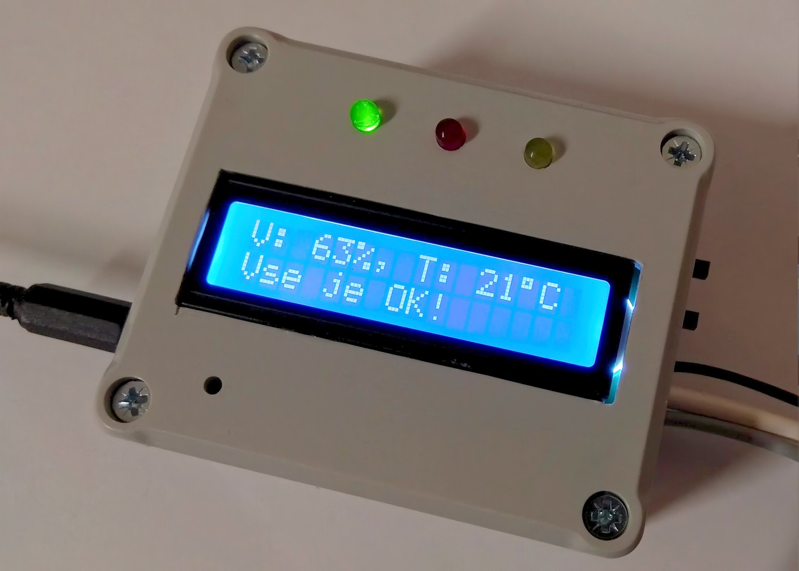

# Automatický regulátor vlhkosti vzduchu pro terárium

Cílem bylo navrhnout a realizovat jednoduché a finančně dostupné zařízení, které automaticky reguluje vlhkost vzduchu v teráriu. Návrh vznikl na základě potřeb teraristů. 
 
 
#### Obsah repozitáře:
- Dokumentace
- Zdrojový kód pro Arduino Nano (soubor main.cpp)
- Knihovny ke kompilaci zdrojového kódu (složka lib)
 
 

